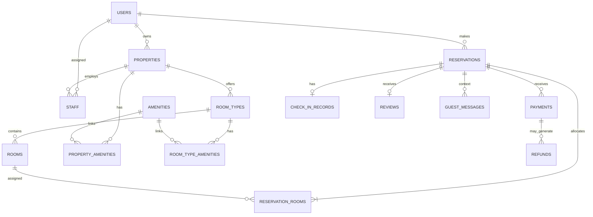

```mermaid
erDiagram
  USERS ||--o{ PROPERTIES : owns
  USERS ||--o{ RESERVATIONS : makes
  USERS ||--o{ STAFF : assigned
  PROPERTIES ||--o{ ROOM_TYPES : offers
  ROOM_TYPES ||--o{ ROOMS : contains
  PROPERTIES ||--o{ PROPERTY_AMENITIES : has
  AMENITIES ||--o{ PROPERTY_AMENITIES : links
  ROOM_TYPES ||--o{ ROOM_TYPE_AMENITIES : has
  AMENITIES ||--o{ ROOM_TYPE_AMENITIES : links
  RESERVATIONS ||--|{ RESERVATION_ROOMS : allocates
  ROOMS ||--o{ RESERVATION_ROOMS : assigned
  RESERVATIONS ||--o{ PAYMENTS : receives
  PAYMENTS ||--o{ REFUNDS : may_generate
  RESERVATIONS ||--o| CHECK_IN_RECORDS : has
  RESERVATIONS ||--o| REVIEWS : receives
  PROPERTIES ||--o{ STAFF : employs
  RESERVATIONS ||--o{ GUEST_MESSAGES : context
```
